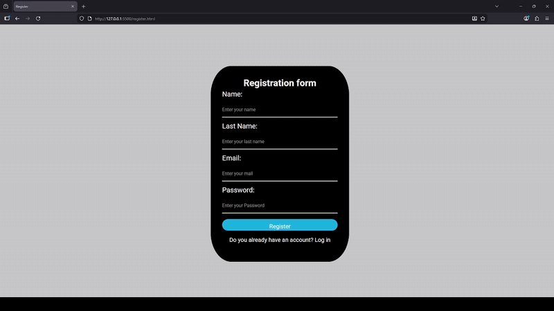

# 📱 Social Media & Contact Form

This is a web development practice project focused on mastering the **CSS Box Model**, **Positioning**, and **Modern Gradients**. The goal was to create a clean, functional, and visually striking user interface using professional industry standards.

## 📸 Demo


---

## 🚀 Key Features

* **Structured Layout:** Utilization of `display: block` and `flexbox` to ensure perfect alignment within the form container.
* **Social Media Integration:** Custom buttons for Facebook, Instagram, Twitter, and Email.
* **Visual Polish:** Official Instagram gradient implemented via `linear-gradient`.
* **Interactivity:** Smooth transitions using `ease-in-out` and optimized focus states for accessibility.

---

## 🛠️ Technologies & CSS Concepts Applied

Throughout this project, I deepened my understanding of the following CSS core concepts:

* **Box Model (`border-box`):** Implemented to ensure element sizing remains predictable and isn't broken by padding or borders.
* **Relative/Absolute Positioning:** Used to anchor icons inside buttons without disrupting text flow.
* **Cascading & Specificity:** Organized CSS rules logically, respecting selector hierarchy (IDs vs. Classes vs. Elements).
* **Accessibility:** Managed `outline: none` by replacing it with custom `:focus` styles for keyboard navigation.

---

## 💡 Lessons Learned

During this challenge, I mastered:
1. **Layout Control:** Understanding why an `h2` should be explicitly set to `display: block` within a form context.
2. **Gradient Aesthetics:** Configuring `linear-gradient` with multiple color stops to replicate real-world brand palettes.
3. **Animation Persistence:** Using `animation-fill-mode: forwards` to prevent elements from snapping back to their initial state after an animation ends.

---

## ⚙️ Installation & Usage

If you want to run this project locally:

1. Clone the repository:
   ```bash
   git clone https://github.com/juanturriago7/form-login.git

2. Open index.html in the browser
